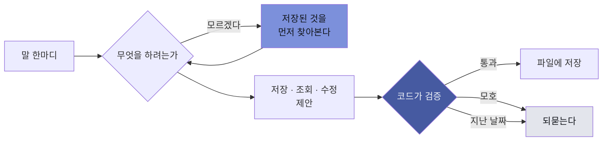

# Adsum

> 라틴어로 **"나는 여기 있다"**

바탕화면에 상주하는 캐릭터입니다. **말을 걸면 일정과 할 일이 저장됩니다.**

캘린더 앱을 열고, 날짜를 찾고, 제목을 치고, 시간을 고르고, 저장을 누르는 그 십몇 초.
그게 매번 못 이겨지는 벽이라 아숨을 만들었습니다.

**[→ adsum.page 보러 가기](https://leehwon0217.github.io/adsum-landing/)**

<sub>Windows 10/11 · v0.1.0 · 월 8,700원 · 일정은 이 컴퓨터에만 저장됩니다</sub>

---

## 어떻게 쓰나

```
나 23일에 예비군 가야해
  → 몇 시부터 몇 시까지인지 아세요?

12시부터 6시까지, 성내3동 주민센터
  → 8월 23일 오후 12:00~6:00 성내3동 주민센터에서 예비군 일정을 저장했어요!
```

창을 열지 않습니다. <kbd>Ctrl</kbd> + <kbd>Space</kbd>를 누르거나 아숨을 클릭하면 입력칸이 열립니다.

---

## 저장된 것을 보고 답합니다

가장 최근에 들어간 것입니다. 아숨이 **먼저 찾아보고 나서** 대답합니다.

```
예비군 끝나고 저녁 약속 잡아줘
  → 8월 24일 오후 6:00에 저녁 약속 저장했어요. 예비군이 6시에 끝나거든요.
```

앞으로 잡힌 예비군이 없으면 없다고 말합니다. **지난 날짜에 저장하지 않습니다.**

이어지는 물음도 알아듣습니다.

```
나 면접 언제야?
  → 9월 2일 (수) 오후 3:00 아와소프트 임원면접

몇시간 남았어?
  → 아와소프트 임원면접은 18시간 15분 남았어요.
```

두 번째 물음에는 이름이 없습니다. 방금 무엇을 보여줬는지 알고 있어서 그대로 이어집니다.

세는 물음도 답합니다. **세는 일은 AI가 하지 않고 코드가 합니다** — 그래서 몇 번을 물어도 같은 숫자가 나옵니다.

```
이번달 야간 몇 번이야
  → 야간은 5번이에요. 지난 게 3번, 앞으로 2번이에요.

이번주 알바 몇 시간 했지
  → 알바는 21시간이에요. 다만 시각이 안 적힌 게 1개 있어서 실제로는 더 될 거예요.
```

---

## 한 마디가 어디로 가나



**판정은 코드가, 문구는 AI가.**

무엇을 저장할지·지울지·언제로 잡을지는 전부 코드가 정합니다.
AI는 "무엇을 하려는 말인가"까지만 판단합니다.
그래서 **없는 일정이 생기지 않고, 모호하면 반드시 되묻습니다.**

---

## 바탕화면에서

```
┌──────────────────────────────────────────────┐
│                                              │
│   ┌──────────────┐                           │
│   │ 포트폴리오 수정 │                           │
│   │ 오늘까지       │      ┌──────────────┐    │
│   └──────────────┘      │ 세탁물 찾기    │    │
│        ┌──────────────┐ │ 어제부터 밀림  │    │
│        │ 우유 사기     │ └──────────────┘    │
│        │ 퇴근길에      │                     │
│        └──────────────┘                      │
│                                              │
│                        ┌───────────────────┐ │
│                        │ 예비군 2:14:08 뒤 │ │
│                        └───────────────────┘ │
│                              ╭─────╮         │
│                              │ ●_● │  ← 아숨 │
│                              ╰─────╯         │
└──────────────────────────────────────────────┘
```

창이 하나도 안 열려 있는 상태입니다.
할 일이 생기면 아숨이 그 자리까지 **걸어가서** 종이를 붙이고 돌아옵니다.
세 시간 안에 일정이 있으면 남은 시간이 옆에 뜨고, 시간이 되면 말을 겁니다.

포스트잇은 손으로 옮기고, 돌리고, 화면 왼쪽으로 밀어 둘 수 있습니다.
밀어 두면 오른쪽 끝만 살짝 남고, 커서를 올리면 조금 더 나옵니다.

---

## 하지 않는 것

하루 종일 켜 두는 프로그램이라, 무엇을 **안 하는지**가 더 중요합니다.

| | |
|---|---|
| **무엇을 치는지 읽지 않습니다** | 같이 일하려면 지금 타자를 치는 중인지는 알아야 합니다. 그래서 **키가 눌렸다는 사실과 그 시각만** 받고 어떤 키였는지는 확인하지 않습니다. 설정에서 끌 수 있습니다. |
| **일정은 이 컴퓨터에만 있습니다** | 서버도 로그인도 없습니다. 파일 하나로 내보내고 가져옵니다. 가져오기는 덮어쓰지 않고 합칩니다. |
| **지운 것은 되돌릴 수 있습니다** | 지운 일정도 실제로는 남아 있습니다. 되돌릴 수 없는 동작은 되도록 만들지 않았습니다. |
| **해지해도 일정은 남습니다** | 결제를 멈추면 말로 넣는 기능이 멈출 뿐, 저장된 것은 그대로 열리고 언제든 내보낼 수 있습니다. |

바깥으로 나가는 것은 **방금 한 그 문장 하나**뿐입니다. 말을 알아듣는 데에만 씁니다.

---

## 안 되는 것

파는 사람이 숨기고 싶은 쪽입니다. 어차피 쓰다 보면 알게 될 것이라 먼저 적습니다.

- **Windows만 됩니다.** macOS 빌드는 아직 만들지 않았습니다.
- **휴대폰에서는 볼 수 없습니다.** 기기 사이 동기화가 없습니다.
- **돈은 다루지 않습니다.** 매출도 급여도 가계부도 없습니다. 일정 앱이 장부까지 하려 들면 둘 다 어설퍼집니다.
- **날씨를 모릅니다.** 바깥과 통신하는 것은 말을 알아듣는 그 한 번뿐입니다.
- **말투가 들쭉날쭉합니다.** 같은 물음에 답이 조금씩 다를 때가 있습니다. 다만 무엇을 저장하고 지울지는 코드가 정하므로 **일정이 틀어지지는 않습니다.**
- **아직 쓰는 사람이 없습니다.** 후기도, 자랑할 사용자 수도 없습니다.

---

## 어떻게 확인하나

쓰는 사람이 없으니 후기를 붙일 수 없습니다. 대신 이렇게 확인합니다.

| | |
|---:|---|
| **34명** | 간호사·자영업·수험생·라이더·현장소장까지, 가상 사용자를 만들고 각자의 일정을 채웁니다 |
| **1,020문장** | 그 사람들이 할 법한 말을 실제로 돌려 **어디서 틀리는지 셉니다.** 오타도 사투리도 그대로 둡니다 |
| **394개** | 코드에 붙은 자동 시험 |
| **96개** | 왜 그렇게 정했는지의 기록 |

문장은 이런 것들입니다 — 일부러 어려운 것만 골라 넣었습니다.

```
아와소푸트 면접 언제지        오타
밀린거뭐있어                띄어쓰기 없음
어 그 수요일 새벽 여섯시에 타설  음성입력체
나이트 끝나고 병원 가야 돼     자정을 넘긴 근무의 끝 시각
면접 취소해줘               면접이 둘이면 → 되물어야 정답
이번달 매출 얼마야           못 하는 것 (지어내면 안 됨)
```

**"못 하는 것"도 시험에 넣습니다.** 없는 기능을 지어내지 않는가를 세기 위해서입니다.

---

## 지금 단계

| | |
|---|---|
| 운영체제 | Windows 10 / 11 |
| 여는 법 | 아숨을 누르거나 <kbd>Ctrl</kbd> + <kbd>Space</kbd> |
| 계정 | 없음 |
| 동기화 | 없음 — 파일로 내보내고 가져옵니다 |
| 단계 | v0.1.0 · 로컬 전용 |

아직 내려받을 수 없습니다. 나오면 알려드릴게요 —
**[메일 남기기](mailto:wob0217@gmail.com?subject=Adsum%20출시%20알림)**

---

<sub>이 저장소에는 소개 페이지만 있습니다. 앱 소스는 공개하지 않습니다.</sub>
